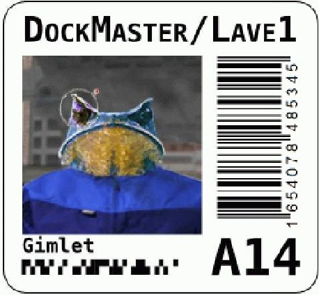
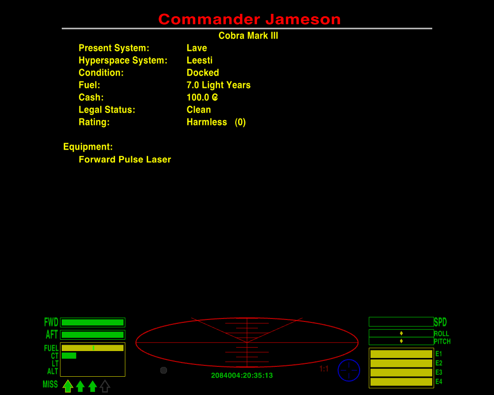
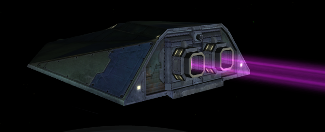
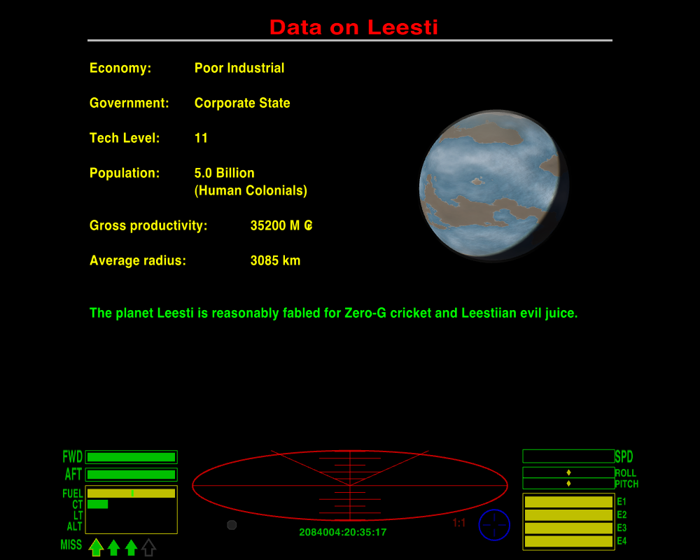
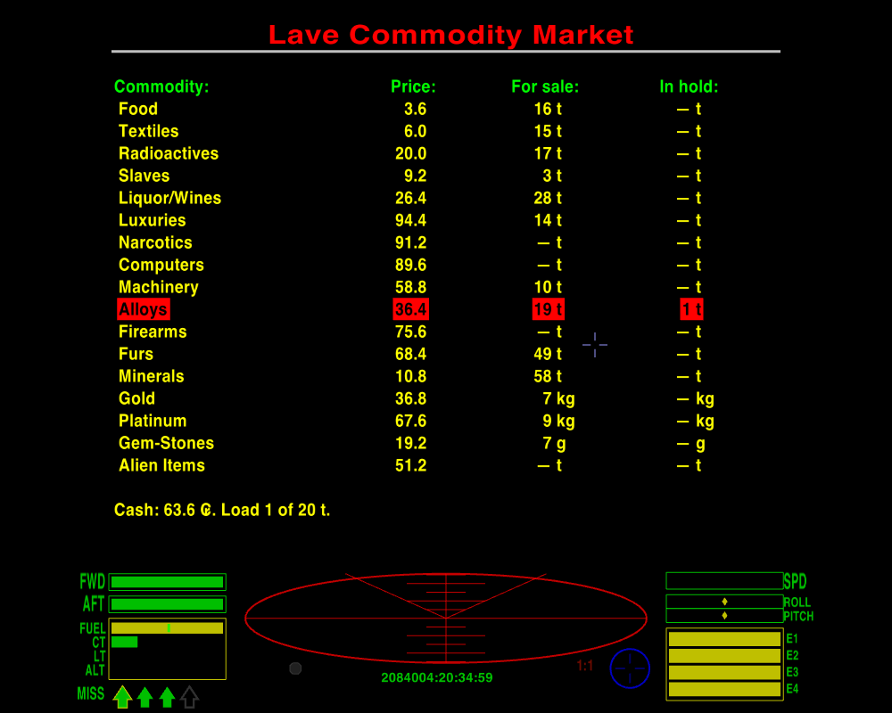
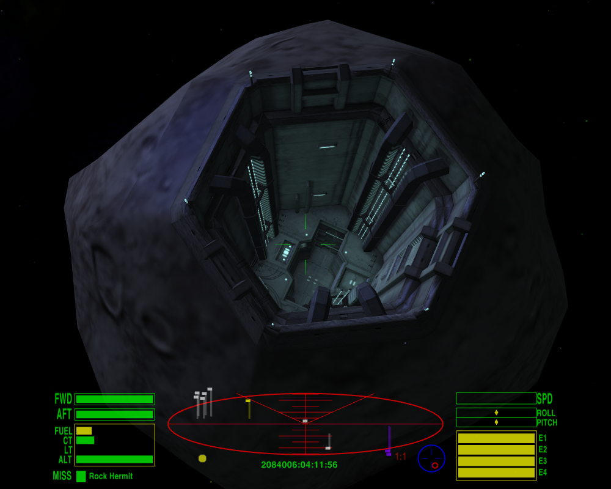
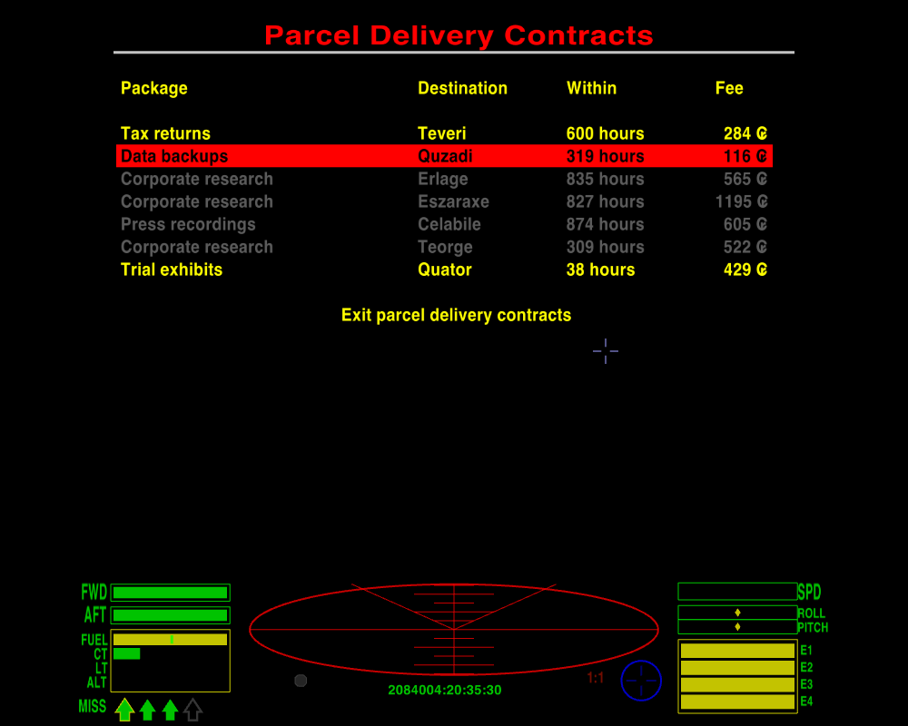

{ width="10%" }

**File:** OAfNC2009

**TD Index:** 20832312:10:20:00

**Source:** Security Recording, Dock Master’s Office, Galactic Cooperative of Worlds Station Lave 1

**Persons Involved:** Dock Master Mr. TBF Gimlet, a ‘*Commander Jameson’*

**Subject:** Advice for New Commanders.

**Notes**:
■ This information has been archived as it contains valuable advice for independent commanders wanting to
make their mark on the GCW.
■ Mr Gimlet’s advice comes from over 40 years of experience of being the Dock Master to the
busiest station in the Galactic Cooperative of Worlds.

{ width="20%" }

■ The Transcript has been edited for brevity and relevance. The
original can be source in the Oolite Central Archives (the Oolite Wiki).

All right there! You just got your pilot’s ticket. Can I just say that your zip-clip there doesn’t do you justice?
You’re itching to get off and out into the big black, I can tell; but we just got a few final once-overs before I can
stamp that thing legal. Shall we?

So. You got yourself a brand and shiny-new Cobra Mark III. Cowell and MgRath’s finest, yes siree: more’n sixty years
since the first one rolled off the line right here on Lave, and it’s still one of the best. An all-round ship, you get
me? It ain’t the fastest, and it ain’t the strongest, nor the most killing neither, and it definitely ain’t the biggest,
by a long shot, but a sweet little number in her own right, no error.

{ width="70%" }

Let’s take a tour around ... Hoo boy, she is mint, ain’t she! I just love that new-ship smell. Take a sniff, go on:
yeah, well, most of them long-chain monomers is carcinogenic, so don’t you snort too deep ...

Hah! I’m just funnin’ ya, kid. If pulling a tick from sniffing the command console was all a pilot had to worry about,
life would be gravy! No, there’s more’n enough out there to kill you plenty quick, if you don’t watch out, shiny new
ship or no.

{ width="70%" }

I see a lot of blanks on this here board ... I’m guessing your ship is, whadda they call it, a basic model, yeah? Legal
minimum? Uh-huh, I thought so. Man oh man, they shouldn’t oughta let kids out in a machine like this; it’s a sin, is
what it is. Some bandit takes a pop at you, and what you got to hold your end up with? A Pulse Laser. A Pulse Laser’s
one step up from a penlight, kiddo. Oh, it’s a better defence than just harsh language, and there’s always a chance you
might be attacked by a really nervous pirate – but seriously: if you ever want to shift that “Harmless” tag you better
beef up your armaments, and soon! Beam Laser, minimum. Until then you’d best stick to the cop-end worlds: Democracies
and Corporates, Confederacies maybe if you’re feeling lucky, you hear me? And remember: your av’rage villain don’t care
too much if you live or die, just so long as he gains some out the deal ... right now, by my estimation, you ain’t in no
shape to argue your case. So if’n you do get rolled, you just swallow your pride, drop your cargo, and hope it
satisfies. It’s a bitter pill, I know, but poor and living beats rich and dead, every time.

See, right here is what I’m talking about: this is where you need to fit an ECM. Someone locks a missile on you, you pop
that sucker fast. Oh, I know there’s Hardheads out there, shielded missiles proofed against countermeasures, but a good
ECM can pop those too, if you’re lucky. You get one of those running on you, you turn tail and run from it as fast as
you can. A warhead’s nasty, but no sense in giving it a kinetic advantage too, right? Keep slapping the ECM as you go,
if you’ve got the energy for it: if the first burst don’t kill it, maybe the next one will.

{ width="70%" }

Speaking of running ... over here is where you’d control your Witchdrive Fuel Injectors, if’n you had ’em ... dumps fuel
straight from the tanks into the drive, and shoots you off like an Oresquan on a hot date. Good for whatever ails ya,
from pushing past a mass-lock to getting the hell out of town!

Down here, now, this is your Fuel Scoop indicator ... huh, “offline”, I see. Sure, sure, you don’t think you’ll ever
need to kiss the stars: why bother, when fuel’s cheaper than Celabiler poetry? Well, maybe it’s true, and maybe it
ain’t, but anyways this piece of kit scoops up more than just sunshine. There’s scraps and salvage out there, kid, and
good money to be had. Skim on over the top and this puppy drops ’em straight into the cargo bay. Pays for itself in no
time. Sweeps up Escape Pods, too: you get the chance to bring someone safe home, you take it – even if it means dumping
some of your own payload to take them on board. Look out for the other guys and they’ll look out for you.

And ... sweet Lord Giles on a gyrospider, they didn’t even fit you out with a Docking Computer! “Optional Extra”, my
shiny blue ass ... Oh, sure, manual docking’s easy enough, but there’s a knack to it. You gotta get that knack first,
though. Practice it. Before you go anywhere, practice it. Fly out to the station buoy, turn around and come back in
again, until you got it pat. And match the rotation: you put scrapes or dents or a big long greasy smear all over my
bay, and I will NOT be pleased ...

Oh, there’s a whole bunch of other junk you can stick on here: a Scanner Targeting Enhancement, for one, if you ever get
yourself set up right for a firefight. Even before then, maybe: if you can clock pirates before they start their run on
you, that’s half the battle. Well, quarter of the battle. Or a fifth. Some proportion, anyhow. The Advanced Space
Compass, too, now that’s a handy doodad to have on board. And an Extra Energy Unit to boost your recharge. And Shield
Boosters, now they’re a no-brainer. And – okay, most of this junk is too high-tech for Lave: you can get most everything
at Zaonce, though, just a wormhole away. Dull kinda burg, Zaonce, but they know their quarks from their quaternions.
Shouldn’t set you back more’n ten, twenty thou.

{ width="70%" }

You got how much? One hundred creds. One ... hundred ... creds. Ayoha. All right then. Let’s break it down. Your problem
here is financial, not technical. Maybe at bottom it’s psychological, but I’ll give you the benefit.

There’s two types of money, kid: fast, and slow. Fast money comes easy, and slow money comes hard. The slow is sure and
steady, though, and the fast, well, it might make you wish you had waited. I’ll run you through them both, and you can
make up your own mind.

For the fast money, there’s this sweet and cherry Cobra III: you sell it, right now, you’ll net yourself enough to buy a
second-hand ship with enough scratch left over for some half-decent kit. ’Course, some of these second-hand numbers are
pretty, well, used, if you know what I mean, and come with problems of their own. I mean, you ever try to take a dump in
a head designed for some other guy’s anatomy? And the resale sucks, if’n you ever want to move on up. But it’s an
option.

{ width="70%" }

Slow money, now, that’s less chancy. You buy up what’s cheap, you take it to where it’s expensive, and you sell it at a
profit. Rinse and repeat. What’s cheap where, and what’s expensive? Supply and demand, kid. Like the philosopher said,
“it’s the economy, stupid”. Agricultural worlds produce raw materials like minerals and radioactives, and the
bio-products like food, textiles, booze and furs, too. Industrial planets make finished goods, like luxuries, computers
and machinery. So you take the produce of one and you sell it on the other, and chances are you’re making money on the
deal. Politics don’t matter squat: farmers need harvesters and factories need feedstock!

O’course, money matters: rich Industrials are rich because they’ve got the most efficient processes, so not only do they
make the cheapest products, their factories are the hungriest and they’ll pay the best prices for raw materials. Poor
Agriculturals, on the other hand, they’re most desperate for fine articles and will scrape together whatever they can to
pay for ’em: meanwhile, they’ll offer you the cheapest deals anywhere for what they make themselves. Which puts a
vicious lock on the poverty trap, but hey: nobody said life was fair. Folks like you who’ve climbed up the gravity well,
you’re just filling a need. Buy and sell between rich Industrials and poor Agriculturals, that’s my advice! There’s
money to be made elsewhere, no error, but those are the sweetest runs you’re likely to hit on. Bulk is the key, kid: the
more you carry, the more you make. This Cobra III here can take twenty tons, right now: for just 400 creds more you can
get a Cargo Bay Expansion to take you up to thirty-five. That extra fifteen tons of space will pay for itself and more
in one good run, if you can fill it up.

{ width="70%" }

It ain’t all bulk, though. Watch the board for cheap deals on precious metals and gemstones: they might not offer the
greatest profits, but they don’t take up any cargo space at all. See this safe over here, behind this bulkhead? You take
on platinum, or gold, or a sack of gemstones when you’re docked, they go right in here. You can keep ’em here as long as
you like, until you find somewhere to offload ’em. Co-op rules stop you dropping too much of ’em, or too much of
anything, come to that, in one station – so much for free trade! – but as a slow-burn money-maker there’s not much to
beat it. You can buy the shinies cheap off the miners direct, if you run across a Rock Hermit. It’s thirsty work,
cracking rocks … you can learn that for yourself, if’n you get a Mining Laser to go with your Fuel Scoop, and you don’t
mind scraping carbon scoring off the scoop every few jumps. Only don’t, for any sake, put the Mining Laser on the nose!
It’s a tool, not a weapon.

{ width="70%" }

What “other” products? What you winking for, kid? You mean slaves, narcotics and firearms? Why don’t you just damn well
say so? They ain’t illegal. They’s what we call controlled merchandise. You find ’em out there, you can bring ’em in,
much as you want, all nice and legal ... what will get you into trouble with the Blues is shipping them out of a main
system station.

{ width="70%" }

There’s long-range shipping contracts on offer, too, in some stations: F4 will bring ’em up, if there’s any there. You
buy the deal and then get paid a bonus if you make the delivery on time. They’ll be out your price-range just now, and
anyway most of ’em call for a bigger cargo-hold than a Cobra can carry. Keep an eye out for any you might be able to do,
though; if you build a rep as a reliable carrier then the jobs can get real juicy. And there’s always a few small
packets need shifting too: even the smallest ship can stow a few parcels in the cockpit. Remember to check out the route
beforehand, though: the destination might be all sweetness and light, but you best see what you might have to swim
through first to get there.

That’s slow money, kid: work, save, invest, and work again, that’s what it’s all about! It ain’t pretty but it gets you
there in the end.

Huh. Anyhow. I’m a busy frog, I can’t stay here all day filling in every Jameson on what they should have learned in the
spawning pond. Gimme your ticket, kid, and I’ll stamp it flight-ready, though Giles knows I prob’ly shouldn’t ... there
ya go. That’s you ready to take on the Witch. Jens help us all ... don’t know enough to keep a level bearing through a
wormhole ... what they send up here for us to deal with ... pick up the pieces more like …

| *Advice for New Commanders* by Disembodied © 2008-2026.                                                                                                                                                                                                                                                                                                                                                                                                                                                                                                                                                               |
|:----------------------------------------------------------------------------------------------------------------------------------------------------------------------------------------------------------------------------------------------------------------------------------------------------------------------------------------------------------------------------------------------------------------------------------------------------------------------------------------------------------------------------------------------------------------------------------------------------------------------|
| Screenshots, editing and formatting of this version by cim. Creative Commons – BY – NC – SA 3.0 © 2015 *Oolite* created by Giles Williams and contributors © 2003-2026 GNU General Public License V2 Creative Commons License: BY - NC - SA 3.0 Oolite Website: https://www.oolite.space Oolite Wiki: https://wiki.alioth.net/index.php/Oolite Oolite BBS: https:///bb.oolite.space  *Oolite* is inspired by the *Elite* computer game series, originally created by Ian Bell and David Braben  This document was originally created using OpenOffice 3.0, Inkscape, Paint.net and IrfanView. |