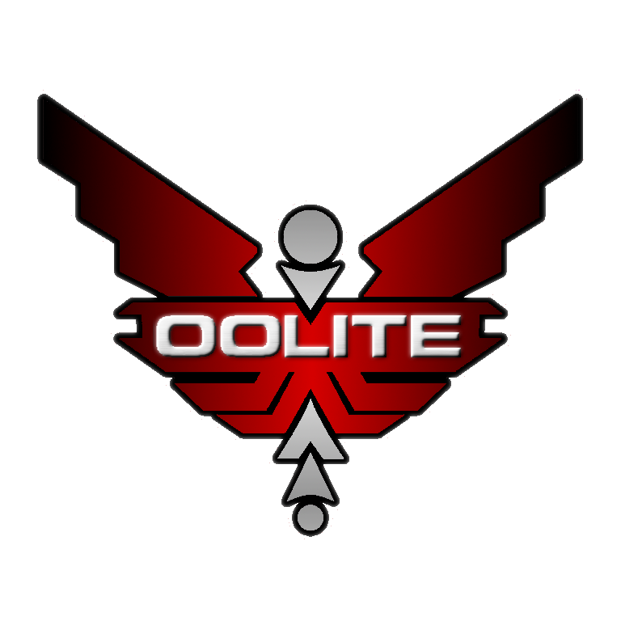

{: width="30%" }

# Oolite

## Installation

### Mac OS X

Oolite requires Mac OS X 10.5 or later

Drag the 'Oolite' folder (containing Oolite, this ReadMe, the License and the 'AddOns' folder) to any convenient place on your hard drive. If you are upgrading from a previous version of Oolite then drag the Oolite application from this disk's Oolite folder to your own Oolite folder.

To run the game, double-click on the file 'Oolite.app' (the Oolite icon) in the 'Oolite' folder.

### Windows

A folder called 'Oolite' has been created in Start -> Program Files. This folder has icons for running the game, the reference sheet, the link to the official Oolite website, the Advice for New Commanders guide, this ReadMe and an uninstall program.

To run the game, choose the Oolite icon in the 'Oolite' folder.

### Linux *(oolite.space package)*

*(this section is not applicable for installed packages downloaded from Linux repositories)*

For all freedesktop.org-compliant desktops (e.g. GNOME, KDE, etc.) an 'Oolite (oolite.org)' entry has been created, under the 'Games' application category. Note that a plain 'Oolite' entry, instead of 'Oolite (oolite.org)', indicates an Oolite installation performed using a package downloaded from a Linux repository. Linux repositories often lag behind the latest official application releases. It is recommended to download and install the latest Oolite version available at [https://www.oolite.space](http://www.oolite.org/).

To run the game, choose the 'Oolite (oolite.org)' entry.

Oolite may also run from a terminal. For system-wide Oolite installations (i.e. Oolite installed as root), open a terminal and execute

$ oolite

while for home-folder Oolite installations, open a terminal and execute

$ ~/GNUstep/Applications/Oolite/oolite

To remove Oolite, for system-wide installations (i.e. Oolite installed as root), open a terminal and execute

$ /opt/Oolite/uninstall

while for home-folder Oolite installations, open a terminal and execute

$ ~/GNUstep/Applications/Oolite/uninstall

For more information, on the Oolite for Linux installation, check the README.TXT file located in the following folder:

system-wide Oolite installation /opt/Oolite/doc/README.TXT

home-folder Oolite installation ~/GNUstep/Applications/Oolite/doc/README.TXT

## Start Menu

When starting Oolite, a menu with six options will be displayed.

### Start New Commander

Start a new commander. Three starting scenarios are available by default, though expansion packs may add more. New players may wish to start with the Tutorial scenario which introduces the basics of flight and combat. A commander started with the Strict Mode option will never have any expansion packs affecting the game-play, even if these are installed at a later stage.

### Load Commander

Load an existing commander file.

### View Ship Library

View the specifications and descriptions of the ships and other common space objects.

### Game Options

Opens the Game Options screen to allow for game settings to be viewed and changed (See Game Options below for more details).

### Manage Expansion Packs

Install and remove mod packs. Not all mod packs can be installed and removed by this method – others, especially older ones, can be found at [https://wiki.alioth.net/index.php/OXP\_List](http://wiki.alioth.net/index.php/OXP_List).

### Exit Game

Exit the game.

## Controls and Commands

The current keyboard configuration can be edited by selecting “Keyboard Configuration” from the “Game Options” menu.

Oolite for Mac OS X is mostly controlled from the keyboard and joystick, although the mouse can also be used in full screen mode.

Oolite for Windows and Linux can be controlled from the keyboard, joystick or mouse.

The list below describes the default key settings.

### In Dock Commands

||||||||
|---|---|---|---|---|---|---|
|**1** or **F1**|**Launch**|Propels your spacecraft from docked station.||||
||||||||
|**2** or **F2**|**Quick-Save / Save / Load**|Use **up** and **down** cursor keys to select, **Enter** to choose.||||
||**Game Options...**|||||
|||**Autosave**|Use left and right cursor keys to disable/enable the 'Autosave' feature.  When enabled, 'Autosave' will create a saved game every time you launch from a planetary station.|||
|||**Docking Clearance Protocol**|When enabled, the main Galcop station (and some OXP stations) will use the docking clearance protocol, and docking without clearance will result in a fine.|||
|||**Source Volume**|Use **left** or **right** cursor keys to adjust the volume for effects and spoken messages.|||
|||**Spoken Messages**|Use **left** or **right** cursor keys or **Enter** to toggle speech off/on.  Spoken messages uses the default voice chosen in System Preferences on Mac, or a selectable voice on Windows and Linux.|||
|||**Music**|Use **left** and **right** cursor keys to toggle music off/on. Mac users have the additional option of “iTunes”.|||
|||**Full Screen Mode**|Use **left** or **right** cursor keys to select screen size and refresh rate.  Changes will only apply the next time you switch into full screen mode.|||
|||**Play in Full Screen / Play in Window (Windows / Linux only)**|Press **Enter** to toggle between Window and Full Screen game view.|||
||||(Mac: Press **⌘-Ctrl-F** during flight to toggle between the two.  All platforms: Press **F12** at any given time during a game session to toggle between the two.)|||
|||**HDR Max Brightness (nits)**|For HDR-capable systems only. Sets the maximum brightness level the HDR monitor is capable of producing.  Use **left** and **right** cursor keys to adjust the value.|||
|||**HDR Paper White Brightness (nits)**|For HDR-capable systems only. Controls how bright a paper white surface should be.  Use **left** and **right** cursor keys to adjust the value.|||
|||**Wireframe Graphics**|Use **left** and **right** cursor keys to deselect/select retro-look wireframe graphics mode.|||
|||**Graphics Detail**|Use **left** or **right** cursor keys to select the desired level of graphics detail between “Minimal Detail”, “Normal Detail”, “Shaders Enabled” and “Extra Detail”. The number of options available depends on your graphics hardware.|||
|||**Gamma**|Use **left** or **right** cursor keys to adjust the gamma correction setting if your monitor requires it.|||
|||**Field Of View**|Adjusts the field of view of your viewscreen. Value range (in degrees) is from 30 to 80. Lower values will limit what you can see, and make objects appear larger. Higher values will increase how much you can see, but make objects appear smaller.  Use **left** or **right** cursor keys to adjust the setting.|||
|||**Colorblind Mode**|Adjusts the color palette to improve the visibility of the game for colorblind players. Options are “None”, “Protanopia”, “Deuteranopia”, and “Tritanopia”. Use **left** or **right** cursor keys to change the mode.|||
|||**Joystick Configuration**|Press **Enter** to go to the joystick calibration and configuration screen.|||
|||**Keyboard Configuration**|Press Enter to go to the keyboard configuration screen to view and change any of the keyboard commands.|||
|||**Back**|Brings you back to the previous screen.|||
||**End Game and Return to Menu**|Press **Enter** to reset the game to the starting menu||||
||**Exit Game**|Press **Enter** to quit the game.||||
||||||||
|**3** or **F3**|**Ship Outfitting** / **Ship Purchase** (toggles between the two)|Use **up** and **down** cursor keys to select, **Enter** to purchase.  Use **left** and **right** cursor keys to move between pages.|||||
|**4** or **F4**|**Ship and Station Interfaces**|Use **up** and **down** cursor keys to select, **Enter** to open the selected interface.  Use **left** and **right** cursor keys to move between pages.|||||
|**5** or **F5**|**Status / Ship’s Manifest** (toggles between the two)|Use **left** and **right** cursor keys to move between pages.|||||
|**6** or **F6**|**Zoomed / Entire range Galactic Chart** (toggles between the two)|Map navigation controls:||||
|||**Mouse drag**|Pan|
|||**PgUp/PgDn** or **mouse wheel up/down**|Zoom In/Out|
|||**Cursor keys** or  **Primary mouse button (single-click)**|Select a hyperdrive target system. When **cursor keys** are used, the map auto-pans when the cursor approaches any map view edge.|
|||**Primary mouse button (double-click)**|Data on target system|
|||**Home**|Select the current system.|
|||**^**|Plots the route from your current system to your target system based on fewest jumps or least time. (requires advanced navigational array).|
|||**?**|Highlights systems by economy, government, tech level, or sun color. (requires advanced navigational array).|
|||**Alt-Left / Right cursor keys**|Select previous / next system for which information will be shown in the system info screen (F7).|
||||||||
||||On the entire range view only, you may type a system name to locate it.||||
||||On the zoomed range view only, '**i**'shows information for each system (economy, government and tech level).||||
||||||||
|**7** or **F7**|**Planetary Database** (shows data on the selected system)|||||
||||||||
|**8** or **F8**|**Commodity Market**|||||
|||**up** and **down** cursor keys|Select commodity|
|||**right** cursor key|Purchase 1 unit of commodity. Holding **Shift** will purchase as much of the commodity as possible.|
|||**left** cursor key|Sell 1 unit of commodity. Holding **Shift** will sell as much of the commodity as possible.|
|||**Enter**|If hold contains at least 1 unit of commodity, sells as much of the selected commodity as possible If no units of commodity in hold, buys as much of the selected commodity as possible.|
|||**?**|Changes the commodity filter from “All goods”, “Carried in stock”, “Carried”, “In stock”, “No transport restrictions”, and “Transport restrictions”|
|||**/**|Changes the sort from “Default”, “Alphabetical”, “Price”, “Quantity in stock”, “Quantity in hold”, and “Unit mass”.|

### Flight Key Commands

||||||
|---|------------------------------------------------------------------------------------------------------------------------------------------------------------------------------------------------------------------------------------------------------------------------|---|---|---|
|**Attitude Controls:**|||||
|**left** and **right** cursor keys| Roll|||
|**up** and **down** cursor keys| Pitch|||
|**,** and **.**| Yaw|||
|| Note: Holding **Ctrl** will make the ship turn more slowly.|||||
||||||
|**Drive controls:**|||||
|**w**| Increase Speed|||
|**s**| Decrease Speed|||
||||||
|**Torus drive:**|||||
|**j**| Toggle the in-system hyperspeed drive ('Torus Jump Drive') on and off.|Note: The drive is disabled by nearby mass/gravity effects.|||
||||||
|**Hyperdrive:**|||||
|**h**| Activate the hyperdrive, also known as the witchspace jump drive.|Note: The witchspace jump drive must have a target destination selected in one of the charts (**F6** key).|||
|**g**| Activate the Galactic Hyperdrive (if installed).|||
||||||
|**Fuel Injection:**|||||
|**i**| Activate the afterburner Witchdrive Fuel Injectors (if installed).|||
||||||
|**Other controls:**|||||
|**p**| pause / un-pause the game.|Note: While paused you can access some elements of the Options menu by pressing **2** or **F2**.  Also, while paused you can press **o** to hide/show the HUD; useful for taking screenshots.|||
||||||
|**Weaponry:**|||||
|**a**| Fire main weapon for the chosen facing.|||
|**\_** (underscore)||Toggle weapons lockdown on/off.|||
||||||
|**Missiles, mines and pylon mounted equipment:**|||||
|**r**| Activate target identification system (deactivating the missile/mine system).|||
|**t**| Enable targeting for the current missile, or arm the current mine. If the target identification system is active and locked on, then this also locks a missile onto the selected target.|||
|**y**| Switch to the next missile or mine available (requires Multi-Targeting System).|||
|**Shift-T**| Immediately target nearest incoming missile.|||
|**u**| If target identification is active, deactivate it and reactivate the missile/mine system. If missiles are active, clear any targets (places them in safety mode).|||
|**m**| Launch the current missile or mine (it must be locked on target, or armed first), and switch to the next missile available.|||
||||||
||||||
|**Selectable Equipment and Multi-function Displays:**|||||
|**Shift-N**| Next selectable equipment|||
|**Shift-Ctrl-N**| Previous selectable equipment|||
|**n**| Activate currently selected equipment|||
|**b**| Change mode for selectable equipment (not used by allequipment)|||
|**Tab**| Activate selectable equipment in fast activation slot 1.|||
|**0**| Activate selectable equipment in fast activation slot 2.|||
|**;**| Rotate the currently selected multi-function display.|||
|**:**| Select the next multi-function display, if your HUD has more than one.|||
||||||
|**Target System Memory Expansion:**|||||
|**+**| Lock on to next target in memory (if installed)|||
|**-**| Lock on to the previous target in memory (if installed)|||
||||||
|**Anti-Missile ECM:**|||||
|**e**| Activate anti-missile Electronic Counter-Measures (if installed).|||
||||||
|**Scanner:**|||||
|**z**| Adjust scanner zoom ratio (only during flight).|||
|||This allows you to 'zoom in' to navigate around small, close-to objects.  A small indicator next to the compass indicates the current scanner ratio (from 1:1 to 5:1).|||
|**Shift-Z**| Zoom out to 1:1 scanner ratio.|||
||||||
|**Advanced Space Compass:**|||||
|**\**| Change compass mode (if the Advanced Space Compass is installed). This toggles your compass between showing the location of the planet, main station (if close enough), sun, your current target, the station beacon, witchpoint buoy, and various additional beacons.|||
|**| ** (vertical bar)||Change compass mode (reverse cycling).|||
||||||
|**Communications:**|||||
|**`**| View communications log. Allows you to see recent ship-to-ship communications.|||
|**Shift-L**| Request / Cancel / Renew docking clearance.|||
||||||
|**View screens:**|||||
|**1** or **F1**| View forward|||
|**2** or **F2**| View aft|||
|**3** or **F3**| View port|||
|**4** or **F4**| View starboard|||
|**5** or **F5**| Status / Ship’s Manifest (see ‘In Dock Commands’ above)|||
|**6** or **F6**| Zoomed / Entire range Galactic Chart (see ‘In Dock Commands’ above)|||
|**7** or **F7**| Planetary Database (see ‘In Dock Commands’ above)|||
|**8** or **F8**| Commodity Market (see ‘In Dock Commands’ above)|||
|**v**| Toggle between external views|||
|**Arrow Keys or Mouse with Capslock**| External free-look camera|||
||||||
|**Automated Docking** (requires Docking Computer):|||||
|**c**| Begin/Abandon automated docking sequence with the main station, or current target. If only one station is in range, no targeting necessary.|||
|**s**| Toggle docking music off/on.|||
|**Shift-C**| Fast docking without docking sequence. Advances the game clock by 20 minutes.|||
||||||
|**Ejecting cargo items:**|||||
|**Shift-D**| Eject one cargo pod.|||
|**Shift-R**| Rotate cargo to determine what will be ejected.|||
||||||
|**Escape pod:**|||||
|**Esc-Esc**| Fast double tap the **Esc** (Escape) key to launch the Escape Pod (if installed).|||
||||||
|**Other Commands:**|||||
|**Mac only:**|||||
|**⌘-q**| **Quit**|||
|**⌘-Shift-F**| Switch between full screen / normal size window.|||
|**⌘-?**||(in windowed mode) Display control keys and license in a Help window.|||
||||||
|**Windows / Linux only:**|||||
|**Shift-Esc**| Quit|||
||||||
|**All platforms:**|||||
|**F12**| Switch between full screen and windowed mode.|||
|**\*** (asterisk)||Take screenshot (writes a '.png' file to the oolite-saves folder under oolite.app).|||
|**Shift-F**| Toggle FPS display|||
|**Shift-M**||(in full screen mode only) Toggle mouse control on and off, having mouse left/right (x-axis) mapped to roll.|||
|**Ctrl-Shift-M**||(in full screen mode only) Toggle mouse control on and off, having mouse left/right (x-axis) mapped to yaw|||
||||||
|||When mouse control is active, the following mouse commands are available:|||
|||**Mouse left/right**|Roll (Yaw, if mouse control is activated using Ctrl-Shift-M)|
|||**Mouse forward/back**|Pitch|
|||**Primary mouse button**|Fire main weapon for the chosen facing.|
|||**Secondary mouse button**|Center mouse control. Cancel roll/yaw and pitch.|
|||**Mouse wheel up**|Increase speed.|
|||**Mouse wheel down**|Decrease speed.|

## Changing user preferences in Windows / Linux

### The user preferences defaults file .GNUstepDefaults

The current settings for the following 'Game Options...' menu entries:

* Autosave (Off/On)
* Sound Volume (Mute to 100% in increments of 5%)
* Music mode (Off/On)
* Full Screen Mode and Display Resolutions
* Wireframe Graphics (Off/On)
* Graphics Detail (Minimum, Normal, Shaders Enabled, Extra)
* Gamma correction (0.02 to 4.0 in increments of 0.02)
* Field Of View (30° to 80° in 20 increments)
* Javascript Runtime (in mib)

are stored in the file (created after Oolite first execution) .GNUstepDefaults and is stored in the following folder:

Windows: *<Oolite installation folder>*/oolite.app/GNUstep/Defaults/.GNUstepDefaults

Linux: ~/GNUstep/Defaults/.GNUstepDefaults *(Note: filenames starting with '.' are considered hidden by default in Linux)*

The recommended way to change these settings is to use the in-game options menu. Troubleshooting or the need to experiment with more advanced options, may lead to directly editing the .GNUstepDefaults file. For the changes to take effect, the .GNUstepDefaults file must be edited and saved before executing Oolite. Windows and Linux differentiate on the file format used. Windows is using the OpenStep format, which is easy to read, while Linux is using the XML format, which is more flexible.

See below a couple of examples on how to directly edit the preferences file for both Windows and Linux. The examples focus in changing from windowed mode to full screen mode at a given resolution, by setting the 'display\_width' and 'display\_height' values, and ensuring the 'fullscreen' property is set to 'YES'.

### Example 1 of 2

The following settings will give a full screen display of 800x600, one quarter sound volume, wireframe graphics enabled, and graphics detail with simple shader effects enabled:

*(Note that if the 'fullscreen' property is set to 'NO', Oolite will read the 'window\_height' and 'window\_width' parameter values and will start in a 640x480 window.)*

{

NSGlobalDomain = {

};

oolite = {

detailLevel = 2;

display\_width = 800;

display\_height = 600;

fullscreen = YES;

volume\_control = 0.25;

window\_height = 480;

window\_width = 640;

"wireframe-graphics" = YES;

};

}

## Example 2 of 2

The following settings will give a full screen display of 1400x1050, full sound volume, wireframe graphics will be replaced by textured surfaces, the Javascript runtime will be set to 64mb (default is 32mb), and extra graphics detail with full effects active:

{

NSGlobalDomain = {

};

oolite = {

detailLevel = 3;

display\_width = 1400;

display\_height = 1050;

fullscreen = YES;

"jsruntime-size-mib" = 64;

volume\_control = 1;

window\_height = 480;

window\_width = 640;

"wireframe-graphics" = NO;

};

}

There are quite a few other settings that can be used inside .GNUstepDefaults and that do not have a relevant Oolite menu entry.

For example:

"use-texture-lod-bias" = NO;

"splash-screen" = NO;

"mouse-control-in-windowed-mode" = YES;

For more information please refer to [https://wiki.alioth.net/index.php/Hidden\_Settings\_in\_Oolite](http://wiki.alioth.net/index.php/Hidden_Settings_in_Oolite) .

## Test Builds

Starting with Oolite 1.77 there are two different versions of the game. A normal version without debugging tools and a slightly slower version with debugging options that can be used with the console. This test build version will be useful for oxp developers.

The test builds have the following extra features:

* When pressing **Shift-F**, the FPS display will show additional info, including a TAF indicator.
* A console can be used, to type in JavaScript commands, interfacing directly with the Oolite universe and its entities.
* The following debugging options are accessible while paused:

**0** Dump a list of all entities in the log-file.

**b** Enable collision test debugging.

**c** Enables octree debugging.

**d** Enables all debug flags.

**s** Enables shader debug messages.

**x** Enables drawing of bounding boxes around all entities.

**n** Disables all debug flags and displays HUD again.

**left** and r**ight** cursor keys Halves/Doubles Time Acceleration Factor.

## Helpful Information

For more information on playing Oolite visit [https://www.oolite.space](http://www.oolite.org/).

Browse the Oolite Wiki at [https://wiki.alioth.net/index.php/Oolite\_Main\_Page](http://wiki.alioth.net/index.php/Oolite_Main_Page) .

Check the Frequently Asked Questions at [https://wiki.alioth.net/index.php/Oolite\_FAQ](http://wiki.alioth.net/index.php/Oolite_FAQ) .

Most Oolite mods, often referred to as OXP’s (Oolite eXpansion Packs) are available at [https://wiki.alioth.net/index.php/OXP](http://wiki.alioth.net/index.php/OXP) , or from the Expansion Manager in the game.

The Oolite Development Project Page (common for Mac OS X, Windows, Linux) is located at <https://github.com/OoliteProject/oolite> .

For answers to questions about playing Oolite, customizing Oolite and anything else Oolite related, post to the Oolite Bulletin Boards at [https://bb.oolite.space](https://bb.oolite.space/) .

Oolite is making use of various external open source libraries, some of them modified to fit certain requirements of the game. For more information about where to find the source code of those libraries, as well as information about the modifications required to make them build for Oolite, please refer to the file *ExternalLibrariesSourceCodeChanges.txt*, found inside the Doc folder of the game’s source code distribution.

Military laser sound courtesy of user “notyermom”, sourced from <https://freesound.org/people/notyermom/sounds/434834/> under license: <https://creativecommons.org/publicdomain/zero/1.0/>

Mining laser sound courtesy of user “bubaproducer”, sourced from <https://freesound.org/people/bubaproducer/sounds/151022/> under license: <https://creativecommons.org/licenses/by/3.0/>

Beam laser sound courtesy of user “jobro”, sourced from <https://freesound.org/people/jobro/sounds/35677/> under license: <https://creativecommons.org/licenses/by/3.0/>

Your feedback is essential to keep improving Oolite.

A lot of effort has been put in making Oolite stable. In the, nowadays rare, event Oolite crashes, it will be highly appreciated if you let us know by raising an issue at <https://github.com/OoliteProject/oolite/issues> or by creating a topic in trhe “Testing and Bug reports” section of the Oolite Bulletin Board, found here: <https://bb.oolite.space/viewforum.php?f=3>. In both cases, attaching the crash log can be very helpful in solving problems. It is located at

Windows: *<Oolite installation folder>*/oolite.app/Logs/Latest.log

Linux: ~/.Oolite/Logs/Latest.log

Mac OS X: ~/Library/Logs/CrashReporter/Oolite.crash.log

Be encouraged to drop by the Oolite Bulletin Board at https://bb.oolite.space to give feedback and chat about the game. It’s the friendliest place this side of Riedquat!

**We are immensely grateful to all the people who have been testing Oolite and tediously bringing it towards perfection.**

**Thank you all!**

## License

Copyright © 2004-2026 Giles C Williams, Jens Ayton and contributors.

This work is licensed under the GNU General Public License version 2.

This program is free software; you can redistribute it and/or modify it under the terms of the GNU General Public License as published by the Free Software Foundation; either version 2 of the License, or (at your option) any later version.

This program is distributed in the hope that it will be useful, but WITHOUT ANY WARRANTY; without even the implied warranty of MERCHANTABILITY or FITNESS FOR A PARTICULAR PURPOSE. See the GNU General Public License for more details.

You should have received a copy of the GNU General Public License along with this program; if not, write to the Free Software Foundation, Inc., 51 Franklin Street, Fifth Floor, Boston, MA 02110-1301, USA.

Additionally, all artwork – 3D models, images and sounds – included in the work, as well as configuration files, are also licensed under the Commons Creative Attribution-Non Commercial-Share Alike License version 3.0. This means that these files may be distributed under either license at your discretion.

To view a copy of Attribution-Non Commercial-Share Alike license, visit <http://creativecommons.org/licenses/by-nc-sa/3.0/> or send a letter to Creative Commons, 559 Nathan Abbott Way, Stanford, California 94305, USA.

You are free:

* to Share — to copy, distribute and transmit the work
* to Remix — to adapt the work

under the following conditions:

* Attribution. You must attribute the work in the manner specified by the author or licensor (but not in any way that suggests that they endorse you or your use of the work).
* Noncommercial. You may not use this work for commercial purposes.
* Share Alike. If you alter, transform, or build upon this work, you may distribute the resulting work only under the same or similar license to this one.

For any reuse or distribution, you must make clear to others the license terms of this work.

Any of the above conditions can be waived if you get permission from the copyright holder.

Apart from the remix rights granted under this license, nothing in this license impairs or restricts the author’s moral rights

Your fair dealing and other rights are in no way affected by the above.

This is a human-readable summary of the Legal Code (the full license).

The source code distribution and the Mac OS X version of Oolite contain parts subject to the following license:

VirtualRingBuffer

Copyright © 2002, Kurt Revis. All rights reserved.

Redistribution and use in source and binary forms, with or without modification, are permitted provided that the following conditions are met:

* Redistributions of source code must retain the above copyright notice, this list of conditions and the following disclaimer.
* Redistributions in binary form must reproduce the above copyright notice, this list of conditions and the following disclaimer in the documentation and/or other materials provided with the distribution.
* Neither the name of Snoize nor the names of its contributors may be used to endorse or promote products derived from this software without specific prior written permission.

THIS SOFTWARE IS PROVIDED BY THE COPYRIGHT HOLDERS AND CONTRIBUTORS “AS IS” AND ANY EXPRESS OR IMPLIED WARRANTIES, INCLUDING, BUT NOT LIMITED TO, THE IMPLIED WARRANTIES OF MERCHANTABILITY AND FITNESS FOR A PARTICULAR PURPOSE ARE DISCLAIMED. IN NO EVENT SHALL THE COPYRIGHT OWNER OR CONTRIBUTORS BE LIABLE FOR ANY DIRECT, INDIRECT, INCIDENTAL, SPECIAL, EXEMPLARY, OR CONSEQUENTIAL DAMAGES (INCLUDING, BUT NOT LIMITED TO, PROCUREMENT OF SUBSTITUTE GOODS OR SERVICES; LOSS OF USE, DATA, OR PROFITS; OR BUSINESS INTERRUPTION) HOWEVER CAUSED AND ON ANY THEORY OF LIABILITY, WHETHER IN CONTRACT, STRICT LIABILITY, OR TORT INCLUDING NEGLIGENCE OR OTHERWISE) ARISING IN ANY WAY OUT OF THE USE OF THIS SOFTWARE, EVEN IF ADVISED OF THE POSSIBILITY OF SUCH DAMAGE.

The MiniZip code used is subject to the following license.

License

----------------------------------------------------------

Condition of use and distribution are the same than zlib :

This software is provided 'as-is', without any express or implied warranty. In no event will the authors be held liable for any damages arising from the use of this software.

Permission is granted to anyone to use this software for any purpose, including commercial applications, and to alter it and redistribute it freely, subject to the following restrictions:

1. The origin of this software must not be misrepresented; you must not claim that you wrote the original software. If you use this software in a product, an acknowledgment in the product documentation would be appreciated but is not required.
2. Altered source versions must be plainly marked as such, and must not be misrepresented as being the original software.
3. This notice may not be removed or altered from any source distribution.

----------------------------------------------------------